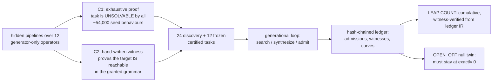

# LeapForge-Gated-VM — Expeditions XVIII & XIX

[](https://deepwiki.com/sunghunkwag/LeapForge-Gated-VM)
[](leapforge_open.py)
[](leapforge_open.py)
[](#6-determinism-you-can-check-yourself)
[](LICENSE)

> Two engines, one measurement discipline. **XVIII** asks whether a
> program searcher does better when its strategy depends on the shape of
> the data in front of it. **XIX** asks a categorically harder question:
> can the engine **grow its own operator vocabulary at runtime** — and
> can every claimed expansion be **machine-certified** instead of
> merely claimed?

## 1. What is this?

The engines write tiny programs (pipelines of list operations like
`sort`, `reverse`, `cumsum`) that must reproduce input→output examples
**exactly**, including on longer held-out inputs they have never seen.
Everything lives in single Python files with **zero dependencies**;
every random decision comes from named, reproducible streams, so any
run can be re-simulated **bit-for-bit**; and every claimed effect must
beat a null arm before it counts.

- `leapforge_gated.py` — **Expedition XVIII** (frozen): a fixed
  vocabulary of 20 primitives searched under a 3D state-gated strategy
  table. Its exhaustive enumerator can *prove* what its vocabulary can
  and cannot express. That prover became the next expedition's judge.
- `leapforge_open.py` — **Expedition XIX**: the vocabulary is open.
  Synthesized operators are **data** (trees in a closed intermediate
  representation, run by a total, hand-written, cost-capped
  interpreter — no `eval`, no `exec`, AST-audited), and an operator is
  admitted **iff it solves a task that was certified unsolvable** by
  the frozen seed vocabulary. Speed-ups on already-solvable tasks are
  explicitly non-evidence.

## 2. Expedition XIX — certified structural self-expansion



The loop, per generation:

1. attempt every unsolved **discovery** task with the current
   vocabulary + gate (the ancestor's gated EA search, unchanged);
2. harvest near-miss traces → the `"opgen"` stream proposes candidate
   operators (random Op-IR growth + mutation/crossover of harvested
   trees), screened for totality and behavioural novelty;
3. each screened candidate re-attempts its associated failing task;
   **admission** requires an exact solve (train + held-out test) of a
   certified, previously-unsolved task *with the candidate in the
   winning program* — then the 6-slice manifold grows a floor-1.0
   row/column for the new token and the full lineage
   `{op_sha, IR, task, certificate, parent→new vocab sha}` is ledgered;
4. every 3 generations a mutated **Gate-IR** tree challenges the
   incumbent in a paired, identical-stream A/B (strict improvement or
   it dies — the generation-0 tree provably equals the ancestor's gate);
5. a disjoint **frozen** set is evaluated for the headline curve and
   never feeds back.



**The two certificates** (both machine-checked per task, both ledgered;
a task without both is discarded):

- **C1 — inexpressibility.** Exhaustive breadth-first enumeration of
  *all* seed pipelines to depth 4, deduplicated by the full output
  vector over the probe battery **plus the task's own train inputs**
  (anti-aliasing guard). The certificate asserts no seed behaviour even
  train-matches the task — so the unmodified engine cannot solve it at
  *any* budget, which makes the null arm's zero structural, not
  statistical.
- **C2 — reachability.** The hidden pipeline, rewritten with
  hand-written Op-IR witness trees, must reproduce every example
  through the same interpreter the engine uses. A failure to leap can
  never be blamed on an unreachable target. Witness trees live only
  inside one function, are never serialized, and are provably
  unreachable from the proposal stream (AST-inspection proof in
  `--selftest`).

**The headline metric** is deliberately unforgiving but permanent:
**LEAP COUNT (cumulative, witness-verified)** = the number of frozen
tasks with at least one ledgered witness `{task, program, vocab sha}`
that **re-executes exactly at report time**, with the operator registry
rebuilt from ledgered IR — never from live state. A witness that fails
re-execution aborts the report as ledger corruption.

## 3. What the live run found (seed 1, ledger committed)

Full profile: 24 discovery / 12 frozen certified tasks, budget 2,000
evaluations per task-attempt, 30 generations, 200 proposals per
generation, ~20.9M evaluations across both arms
(`runs_open/open_546486c354_s1.jsonl` — replay-verified bit-identically,
129 records).

| result | value |
|---|---|
| **LEAP COUNT (cumulative, witness-verified)** | **1 / 12** — task `f04` (`pairmax·pairmax`), first solved at generation 1, solved in 20/30 generations, witness `[o01, o01]` |
| final-generation sample (legacy metric) | 0 / 12 — kept as the honest reminder that a stochastic re-search can miss what it already proved |
| admissions | 2, with full IR lineage in the ledger |
| discovery tasks solved | 7 / 24 |
| **OPEN_OFF null twin** (admission disabled, same budgets) | **0** certified solves in every one of 30 generations |
| efficiency *(not evidence)* | seed-solvable probes: 4/4 in 2,290 evals with the grown vocabulary vs 3/4 in 2,546 seed-only |

The two admitted operators, verbatim from the ledger:

```
o01 = ZIP(MAX(V, A), +1)                    an exact independent rediscovery of the
                                            hidden generator operator "pairmax"
o02 = ZIP(ABS(MUL(ABS(MAX(V,-96)), A)), 0)  behaviourally v*v on bytes; deployed as
                                            [rotate, reverse, o02] — the engine built
                                            "revtail" from seed primitives and let the
                                            pointwise square commute past the permutation
```

The most telling ledger detail: the null twin's synthesis machinery
*found* solving candidate operators for a certified task **five times**
(ledgered as `admission_disabled` refusals) — and without admission the
task stayed unsolved, every time. The structural modification, not
search luck, is what expands the solvable set.

## 4. Expedition XVIII — the frozen ancestor (still fully runnable)

The XVIII question: does a searcher solve harder problems when its
choice of the next operation depends on the current **shape of the
data** — is it sorted? compact? nearly empty? — rather than on habit
alone? Its proposal distribution is a 3D table `W[gate][prev][next]`;
plasticity reinforces exactly the table cells active on an improving
program's path (`η·Δf·ξ`), decaying back toward base.


Eight conditions, all trained on the same tasks at the same total
compute — the 2D baseline is the *same engine* with a constant gate
function, so the contrast isolates exactly one variable:

| condition | plain meaning |
|---|---|
| `COLD` / `COLD2` | no learned knowledge (and its placebo twin — the noise floor) |
| `GATE5` | the full 3D gated engine after 5 rounds of self-improvement |
| `GATE1_5X` | same total training compute, **zero recursion** (the control) |
| `GATED7` | every self-update must beat its own counterfactual A/B or be discarded |
| `COMP5` / `PLASTIC5` / `UNIGRAM5` | gate off / gate+macros off / 1D habit table |

Headline contrasts: **GATING LIFT** (`GATE5 − COMP5`), **MACRO LIFT**
(`COMP5 − PLASTIC5`), **RECURSION PREMIUM** (`GATE5 − GATE1_5X`,
compute-matched) — each read against the `COLD2` placebo floor, each
also on level-4 only, with deployment telemetry (a lift without
multi-gate traces is noise, not mechanism). The pre-registered
expectation is a null; richer containers have never beaten the floor in
this lineage.

## 5. Why the harness is so paranoid

This project's ancestors produced several exciting results that later
died under better controls. Each trap now has a permanent
countermeasure baked in:

| trap that actually happened | countermeasure wired in |
|---|---|
| a "+2.0 transfer effect" from n = 2 runs — pure noise | placebo arm `COLD2` (XVIII); every effect read against this floor |
| "71% headroom" that was really just 7× compute | compute-matched controls (`GATE1_5X`; XIX's OPEN_OFF runs identical budgets) |
| a 480-run study invalidated by silent zero probabilities | guardrail **G1**: no zero probability anywhere — survives XIX's dynamic manifold growth by construction |
| "hard" tasks that were merely unlucky | XVIII: certified difficulty ladder; XIX: per-task **C1 proof of inexpressibility** over the full enumerated behaviour space |
| solvers credited for tasks they didn't generalize | exact-match on held-out longer inputs, always |
| a metric that samples what it should accumulate | XIX.1: LEAP COUNT is cumulative and witness-verified; witnesses re-execute from ledgered IR or the report aborts |
| post-hoc storytelling | expectations pre-registered in source; the GENESIS record embeds the source sha |

## 6. Determinism you can check yourself

```bash
# Expedition XIX
python3 leapforge_open.py --audit             # AST self-audit + source sha256
python3 leapforge_open.py --selftest          # 18-test honesty suite
python3 leapforge_open.py --profile smoke     # full loop in ~40 s, writes a ledger
python3 leapforge_open.py --profile full      # the real run (~40 min)
python3 leapforge_open.py --replay runs_open/open_9989a781a9_s1.jsonl  # bit-identical re-simulation
python3 leapforge_open.py --report runs_open/open_546486c354_s1.jsonl  # leap report from the evidence ledger

# Expedition XVIII (frozen ancestor)
python3 leapforge_gated.py audit
python3 leapforge_gated.py test               # 18-test suite (G1-G5)
python3 leapforge_gated.py battery --seeds 1-40
python3 leapforge_gated.py report
python3 leapforge_gated.py replay
```

No numpy, no torch, no network, no wall clock. All randomness flows
through SHA-256-seeded `XorShift64Star` streams; the append-only ledger
is hash-chained (`sha256(prev_hash + canonical_json(body))`); `--replay`
re-derives every record bit-identically — a proof of determinism *and*
of code identity, because GENESIS embeds the source sha (a ledger
replays against the exact source that wrote it).

## 7. The certified behaviour space (why the proofs mean something)

Programs are pipelines of 20 unary list→list primitives, so composition
is clean and **observational-equivalence pruning is valid**. All seed
pipelines to depth 4 enumerate to 20 / 294 / 3,858 / 47,684 new
behaviours per depth (~52k total; ~54k over the extended per-task
battery). XVIII uses this to *prove difficulty* (a task's level = its
shortest-pipeline length). XIX inverts it into an *impossibility
prover*: a task is admitted to the experiment only if **no** enumerated
behaviour reproduces its training examples — deduplication over the
full battery output vector is sound and complete for that check, so
the certificate covers every seed program up to depth 4, not a sample.

## 8. The math, briefly

Gate classes (XVIII's hardcoded gate; XIX generation-0 reproduces it
exactly as a threshold tree over a 7-feature vector, proven over 10,000
fuzz lists):

$$
g(x)=\begin{cases}
0 & |x|\le 1\\
1 & x \text{ monotone non-decreasing}\\
2 & \max(x)-\min(x)\le 15\\
3 & \text{otherwise}
\end{cases}
$$

Sampling from the active cross-section, with runtime plasticity on
strict improvement and per-generation decay toward base:

$$
P(c \mid g,r)=\frac{W[g][r][c]}{\sum_{c'}W[g][r][c']},\qquad
W_{loc}\leftarrow \lambda W_{loc}+(1-\lambda)W_{base},\qquad
W_{loc}[g_i][r_i][c_i] \mathrel{+}= \eta\cdot\Delta f\cdot\xi
$$

XIX admission, in one line: a screened operator $o$ joins the
vocabulary iff some program containing $o$ exactly solves a task $t$
with a valid C1 certificate that was unsolved before — and the manifold
then grows a floor-1.0 row and column for $o$ in every gate slice.

## 9. Where this sits in the lineage

| stage | contribution carried forward |
|---|---|
| Expedition XI | recursion premium −0.025 (p = 0.876) vs a compute-matched control → the control is now mandatory |
| Expedition XII | the old substrate had **no** difficulty gradient → the certified ladder was built |
| Expedition XIV | the ladder: computed, certified difficulty |
| XV → XVI → XVII | recursion harness → 2D manifold + plasticity trace → macro compilation |
| XVIII | the 3D state-gated manifold, isolated against its own 2D twin |
| **XIX (here)** | the enumerator inverted into an impossibility prover; open Op-IR vocabulary; admission judged by certified leaps; cumulative witness-verified LEAP COUNT |

## 10. Honest status

XIX's live run produced **one machine-certified leap** (1/12 frozen
tasks, one seed, plus 2 admissions and 7/24 discovery solves) with the
null twin at exactly zero — a working demonstration of the mechanism,
**not** a large-n effect study. The remaining 11 frozen tasks are the
honest frontier: most require composing 2–3 synthesized operators, and
the proposal stream rarely lands multi-operator programs at this
budget. XVIII's pre-registered expectation remains a null pending
n ≥ 40 seeds. The scope is 20 list primitives at CPU-poverty scale —
not language, not perception; no claim of general capability is made or
implied. What this repo contributes is the measurement discipline:
**structural self-modification with a proof obligation attached**.

## 11. Files

```
leapforge_open.py    Expedition XIX: the self-expansion engine + 18-test suite + CLI
leapforge_gated.py   Expedition XVIII: the frozen ancestor engine + 18-test suite + CLI
expansion.svg        the XIX figure above (animated SVG, CSS keyframes, no scripts)
manifold.svg         the XVIII figure above (animated SVG, CSS keyframes, no scripts)
runs_open/           committed evidence ledgers for the XIX live run (hash-chained, replayable)
sica/                a separate self-improving-agent harness experiment (own README)
LICENSE              MIT
```
