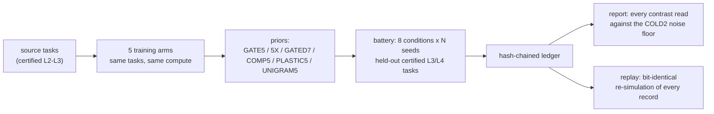

# LeapForge-Gated-VM — Expedition XVIII

[](https://deepwiki.com/sunghunkwag/LeapForge-Gated-VM)
[](leapforge_gated.py)
[](leapforge_gated.py)
[](#5-determinism-you-can-check-yourself)
[](LICENSE)

> A program-search engine that changes its own search strategy based on
> what the data in front of it looks like — tested inside a harness so
> strict that most of its ancestors' "positive results" died in it.

## 1. What is this?

This repository asks one narrow, carefully controlled question:

> **Does a search engine solve harder problems when its choice of the
> next operation depends on the current shape of the data — rather than
> on habit alone?**

The engine writes tiny programs (pipelines of list operations like
`sort`, `reverse`, `cumsum`) that must reproduce input→output examples
**exactly**, including on longer held-out inputs it has never seen.
A normal searcher picks the next operation from a learned habit table.
This one first *looks at the intermediate data* — is it sorted? nearly
uniform? almost empty? — and picks from a strategy table that matches
that situation. Like a cook who tastes the dish before deciding the next
step, instead of following the recipe's step order blindly.

Everything lives in **one Python file with zero dependencies**. Every
random decision comes from named, reproducible streams, so any run can
be re-simulated **bit-for-bit**. And every claimed effect must beat a
placebo arm before it counts.

## 2. The idea in 30 seconds

1. A **task** = input lists → output lists, produced by a hidden pipeline
   whose difficulty level is *proven* (see §6: the certified ladder).
2. The searcher proposes pipelines. Its proposal distribution is a
   **3D table** `W[gate][prev][next]`: given the current *data situation*
   (`gate`) and the *previous operation* (`prev`), how attractive is each
   candidate `next` operation.
3. While searching one task, every strict improvement in partial fitness
   **reinforces exactly the table cells that were active** on the
   improving program's path (`η·Δf·ξ`), and the table decays back toward
   its base between generations — so strategy can shift *mid-run*.
4. Across tasks, solved programs are harvested, recurring operation
   sequences are compiled into **macro tokens**, and the table is refit —
   then the whole loop repeats (recursion).



## 3. Why the harness is so paranoid

This project's ancestors produced several exciting results that later
died under better controls. Each trap now has a permanent countermeasure
baked into this file:

| trap that actually happened | countermeasure wired in |
|---|---|
| a "+2.0 transfer effect" from n = 2 runs — pure noise | placebo arm **COLD2**: identical method, zero knowledge, only the random stream differs. Every effect is read against this floor. |
| "71% headroom" that was really just 7× compute | every recursion claim faces a **compute-matched control** (`GATE1_5X`: same total budget, zero recursion) |
| a 480-run container study invalidated by silent zero probabilities | guardrail **G1**: no zero probability anywhere, ever — enforced by construction and by test |
| "hard" tasks that were merely unlucky (the substrate had no real difficulty gradient) | tasks come from a **certified ladder**: difficulty = shortest-pipeline length, proven by exhaustive enumeration, re-verified per task |
| post-hoc storytelling | the expected outcome is **pre-registered in the source** before any run; the ledger's first record embeds the source sha |

## 4. What the experiment compares

Eight conditions, all trained on the same tasks at the same total
compute. The decisive design property: **the 2D baseline is the same
engine with a constant gate function** — one line of difference — so the
contrast isolates exactly one variable.

| condition | plain meaning |
|---|---|
| `COLD` / `COLD2` | no learned knowledge (and its placebo twin — the noise floor) |
| `GATE5` | the full 3D gated engine after 5 rounds of self-improvement |
| `GATE1_5X` | same total training compute, **zero recursion** (the control) |
| `GATED7` | like GATE5, but every self-update must **beat its own counterfactual** in an A/B trial at equal budget, or it is discarded |
| `COMP5` | same engine, gate switched off (2D + macros) |
| `PLASTIC5` | gate off and macros off (2D only) |
| `UNIGRAM5` | the simplest 1D habit table |



The headline contrasts the report prints:

- **GATING LIFT** = `GATE5 − COMP5` — does looking at the data help?
- **MACRO LIFT** = `COMP5 − PLASTIC5` — do compiled sub-routines help?
- **RECURSION PREMIUM** = `GATE5 − GATE1_5X` — does self-improvement
  compound, or was it just compute?
- each also on **level-4 only** (the frontier), plus deployment telemetry:
  a lift without multi-gate traces in the winning programs is noise, not
  mechanism.

## 5. Determinism you can check yourself

```bash
python3 leapforge_gated.py audit            # AST self-audit + source sha256
python3 leapforge_gated.py test             # 18-test honesty suite (G1-G5)
python3 leapforge_gated.py build            # enumerate + prove the ladder
python3 leapforge_gated.py battery --seeds 1-40
python3 leapforge_gated.py report
python3 leapforge_gated.py replay           # every record must re-simulate bit-identically
```

No numpy, no torch, no network, no wall clock. All randomness flows
through SHA-256-seeded `XorShift64Star` streams; the append-only ledger
is hash-chained (`sha256(prev_hash + canonical_json(body))`), and
`replay` re-derives every record — it is a proof of determinism *and* of
code identity, because the GENESIS record embeds the source sha.

## 6. The certified difficulty ladder (why "level 4" means something)

Programs here are pipelines of 20 unary list→list primitives, so
composition is clean and **observational-equivalence pruning is valid**.
All pipelines to depth 4 are enumerated (20 / 294 / 3,858 / 47,684 new
behaviours per depth); a task's level is the length of the *shortest*
pipeline that produces its behaviour — a theorem, not a guess. Each
sampled task is then **re-certified individually**: every shorter
pipeline is replayed against it, and the 10–25% that admit a secretly
shorter solution are rejected. Levels 1–2 are saturated; level 3 is
climbable; level 4 is the frontier.

## 7. The math, briefly

Gate classes (total, deterministic, O(n), priority-ordered):

$$
g(x)=\begin{cases}
0 & |x|\le 1\\
1 & x \text{ monotone non-decreasing}\\
2 & \max(x)-\min(x)\le 15\\
3 & \text{otherwise}
\end{cases}
$$

Sampling from the active cross-section:

$$
P(\text{next}=c \mid g,\text{prev}=r)=\frac{W[g][r][c]}{\sum_{c'}W[g][r][c']}
$$

Runtime plasticity (per generation decay toward base; reinforcement on
strict improvement, applied to the traced gated path):

$$
W_{loc}\leftarrow \lambda W_{loc}+(1-\lambda)W_{base},
\qquad
W_{loc}[g_i][r_i][c_i] \mathrel{+}= \eta\cdot\Delta f\cdot\xi
$$

with $\lambda=0.90$, $\eta=0.5$, and $\xi=\text{level}/4$ — the certified
minimal depth. Macro admission: cumulative fitness weight $\ge 2.0$
across $\ge 2$ distinct programs, primitive-only bodies, registry cap 6.

## 8. Where this sits in the lineage

| stage | contribution carried forward |
|---|---|
| Expedition XI | recursion premium −0.025 (p = 0.876) vs a compute-matched control: self-improvement gains were compute → the control is now mandatory |
| Expedition XII | the old substrate had **no** difficulty gradient → the certified ladder was built |
| Expedition XIV | the ladder: computed, certified difficulty |
| XV → XVI → XVII | recursion harness → 2D manifold + plasticity trace → macro compilation (each with its guardrails) |
| **XVIII (here)** | the 3D state-gated manifold, isolated against its own 2D twin |

## 9. Honest status

The **pre-registered expectation is a null**: richer containers have
never beaten the noise floor in this lineage, and the burden of proof is
on the gating mechanism — a real effect must show `GATE5 − COMP5` above
the floor *with* multi-gate deployment in the solved frontier tasks.
A smoke run regenerates in minutes
(`battery --profile smoke --seeds 1-3`) and writes a replayable ledger
under `runs/`: machinery proof, deliberately **not** evidence (this
project treats n < 40 as underpowered by construction). The scope is 20 list primitives at
CPU-poverty scale — not language, not perception; no claim of general
capability is made or implied. What this repo contributes is the
measurement discipline.

## 10. Files

```
leapforge_gated.py   the complete engine + 18-test suite + CLI (one file)
manifold.svg         the animated figure above (SVG + SMIL, no scripts)
runs/                created on first run (hash-chained ledgers + ladder cache)
LICENSE              MIT
```
